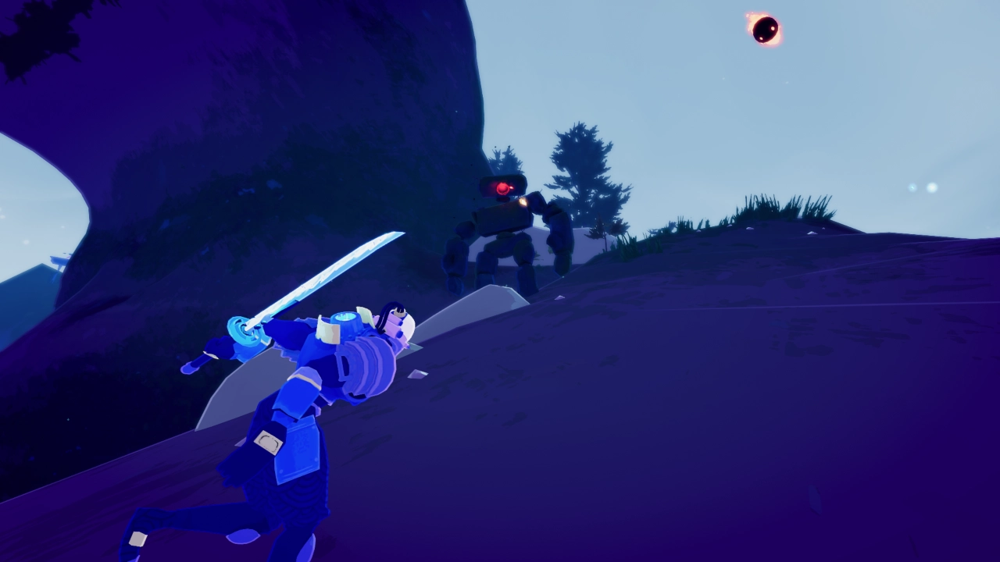

# Risk of Rain 2 Photo Mode
## This is an extremely complex and configurable mod for people looking to create cinematographic footage

### Key Features
#### Smooth (gimbal style) camera by default
Smooths out both the camera movements and rotations akin to a gimbal.
Press `g` to toggle off if you're looking to set up a static shot or dolly path.

Important Settings overview:
* Camera Sensitivity
  * This is the base mouse sensitivity for all camera movements. It *should* match your in-game sensitivity by default at `1`.
* Camera Smooth Pan Speed
   * This is the max speed the camera can move with the movement keys (WASD).
* Camera Panning Smoothing Time
  * This is the time it takes the camera to reach its max speed after pressing a movement key.
  * It's also the amount of time to come to a stop after releasing all movement keys.
  * By default, this is set to 1.5 which means there's 1.5 seconds of inertia in both directions.
* Smooth Rotation Max Speed
  * An arbitrary value that determines how quickly the smooth camera can rotate with the mouse. Setting this to 0 would prevent all mouse movements.
  * The value is quite high by default (depending on your base camera sensitivity) so you'll see effect at or around 0.
  * Set a value very close to 0 if you're looking for extremely smooth movements as that will prevent abrupt changes in rotation.
* Smooth Rotation Decay
  * How quickly the rotation slows after letting go of the mouse. Setting this to 0 means the camera will always continue rotating at the speed it was
  rotating when you let go of the mouse.

If you want a smoother camera than default try increasing the `Camera Panning Smoothing Time` and decreasing both the
`Smooth Rotation Max Speed` and `Smooth Rotation Decay`. For a snappier camera do the opposite.

#### Depth of field (blurry foreground/background)
Allows configuring:
* Focus Distance (adjustable via the mouse scroll wheel)
* Focal Length
* Aperture

By default, this uses a relatively neutral "portrait" style depth of field where the subject is in focus and only background
element rather far away are blurred. If you want a shallower depth of field you can decrease the aperture or increase the
focal length. Because this isn't a real camera there's no functional difference to changing these settings besides modifying
the depth of field.

Default Settings

Shallow DOF (aperture 2.5)

Wide DOF (aperture 8)

 
#### Dolly camera
Lets you set checkpoints for your camera that you can smoothly play back
1. Press `r` to set a starting dolly position
2. Move to another position with a rotation/roll/zoom (also focus distance if you enable dolly auto-focus in the settings)
   * Add more intermediate points with `t` and the dolly will try and transition between them
3. Hold `p` to for dolly playback
 
Dolly endpoint is implicitly set by your camera's current position so after leaving photo mode and returning you can play back the same dolly path as before
* If you make any movement with WASD it will set your camera the new dolly endpoint

#### Arc (follow) camera
Rotates towards the targeted player and follows their position as they move. Arrow keys left/right jump between different targets.

Set the `Smooth Arc Camera Speed` to 0 to just follow the target's position instead of looking towards them.
* The arc camera will also respect any inputs you make so you can use this in conjunction with the smooth camera.